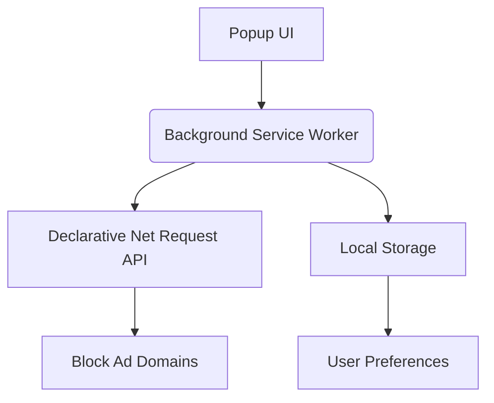

# Ultimate Ad Blocker - Comprehensive Ad Blocking Solution

## Table of Contents
1. [Features](#features)
2. [Installation](#installation)
3. [Usage](#usage)
4. [Technical Details](#technical-details)
5. [Testing](#testing)
6. [Contributing](#contributing)
7. [License](#license)

## Features <a name="features"></a>
- Blocks **all major ad types** including:
  - Banner ads
  - Pop-up ads
  - Video ads (pre-roll, mid-roll, post-roll)
  - Tracking scripts
  - Analytics trackers
  - Social media ads
  - In-game ads
  - Shopping ads
- **300+ ad domains** blocked by default
- Real-time **blocking statistics**
- Customizable blocking settings
- Built-in **ad blocker testing suite**
- Modern dashboard with visual insights
- Privacy-focused design

## Installation <a name="installation"></a>

### Chrome Extension Installation
1. Clone this repository:
```bash
git clone https://github.com/yourusername/ultimate-ad-blocker.git
cd ultimate-ad-blocker
```

2. Open Chrome and navigate to `chrome://extensions/`

3. Enable "Developer mode" in the top-right corner

4. Click "Load unpacked" and select the project directory

5. Pin the extension for easy access

### Firefox Installation
1. Install the [web-ext](https://extensionworkshop.com/documentation/develop/getting-started-with-web-ext/) tool:
```bash
npm install --global web-ext
```

2. Build the extension:
```bash
web-ext build
```

3. Install the generated .xpi file from Firefox's Add-ons page

## Usage <a name="usage"></a>
1. Click the extension icon to open the dashboard
2. View real-time blocking statistics:
   - Number of ads blocked
   - Effectiveness percentage
   - Active protection status
3. Toggle ad blocking on/off using the main switch
4. Customize which ad types to block
5. Test your ad blocker using the built-in testing suite

## Technical Details <a name="technical-details"></a>

### Architecture


### Key Components
- **manifest.json**: Extension configuration and permissions
- **background.js**: Core blocking logic and rule management
- **popup.html**: Dashboard UI
- **popup.js**: UI functionality and interaction
- **rules.json**: Static blocking rules

### Blocking Mechanism
The extension uses Chrome's `declarativeNetRequest` API to block ads at the network level. It maintains:
- 300+ ad domains in a dynamic blocklist
- Separate rules for different resource types
- Smart exception handling for images
- Real-time rule updates

## Testing <a name="testing"></a>
Verify your ad blocker effectiveness using these methods:

### Built-in Tests
1. Open the extension popup
2. Navigate to the "Test Your Ad Blocker" section
3. Run tests for:
   - Basic ad blocking
   - Video ads
   - Tracking & analytics

### External Testing Sites
- [AdBlock Tester](https://adblock-tester.com)
- [Can You Block It](https://canyoublockit.com)
- [Cover Your Tracks (EFF)](https://coveryourtracks.eff.org)
- [Adversity.io Image Test](https://adversity.io/image-test)

### Test Commands
```bash
# Run basic tests
npm test

# Run coverage tests
npm run coverage

# Perform ad blocking benchmark
npm run benchmark
```

## Contributing <a name="contributing"></a>
Contributions are welcome! Here's how to get started:

1. Fork the repository
2. Create a new branch:
```bash
git checkout -b feature/your-feature
```
3. Make your changes
4. Test your changes thoroughly
5. Submit a pull request

### Adding New Ad Domains
To add new ad domains to the blocklist:
1. Edit `background.js`
2. Add domains to the `AD_DOMAINS` array
3. Follow the domain format: `"example.com"`
4. Submit a PR with source information

### Reporting Issues
Please report any issues using the [GitHub Issues](https://github.com/218r1a7230/ultimate-ad-blocker/issues) page. Include:
- Description of the problem
- Steps to reproduce
- Screenshots if applicable
- Browser and OS information

## License <a name="license"></a>
This project is licensed under the MIT License - see the [LICENSE.md](LICENSE.md) file for details.

---

**Ultimate Ad Blocker** is maintained by [Praneeth Kalyan Gurramolla] - LinkedIn-[https://www.linkedin.com/in/praneeth-kalyan-gurramolla-9b8709284/]
